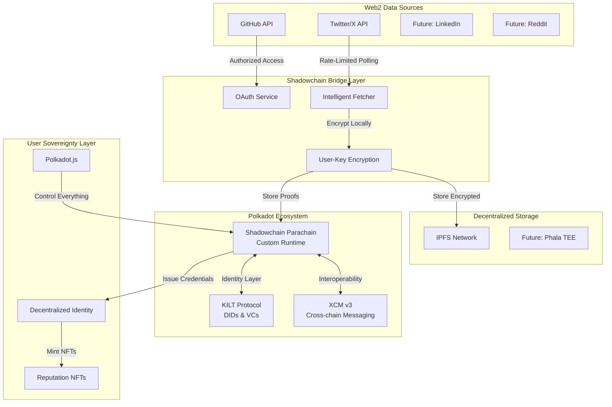

<div align="center">

# 🌀 Shadowchain

## **A Decentralized Reputation Layer for the Open Internet**

[](https://github.com/paritytech/polkadot-sdk)
[](https://substrate.io)
[](https://ipfs.io)


*Shadowchain transforms your Web2 footprint into a verifiable Web3 identity*

[**🚀 Live Demo**](https://shadowchain.locsafe.org) | [**📖 Documentation**](docs/arch.md) | [**🎥 Video Demo**](#) | [**💬 Discord**](#)

</div>

---

## 🌍 **The Vision: Your Digital Shadow, Your Digital Sovereignty**

Shadowchain transforms your digital footprint into a **verifiable, user-owned Web3 identity**. By mirroring your activity into a Polkadot parachain with encrypted IPFS storage, Shadowchain ensures that your online contributions remain **immutable, censorship-resistant, and cryptographically yours**.

> **"Every commit, tweet, and post you make builds your digital legacy. Shadowchain ensures it's truly yours — untouchable, portable, and proof of your impact on the internet."**

Unlike centralized platforms that monetize or censor user data, Shadowchain gives you:

- **Proof of Authenticity**: Blockchain-verified timestamps for every contribution
- **Proof of Ownership**: Encryption keys only you control
- **Proof of Reputation**: Verifiable credentials that demonstrate your impact across the internet

Built on Polkadot, Shadowchain connects to multiple ecosystems via XCM, making your professional and social legacy **portable, provable, and interoperable** across the decentralized web.

**Your work shouldn't depend on someone else's server. Shadowchain makes your digital shadow truly yours.**

---

## ⚡ **Why Now? The Perfect Storm for Web3 Identity**

### **Platform Volatility is Accelerating**
- **X (Twitter) API changes** pricing out developers and researchers
- **GitHub Copilot** training on your code without consent or compensation
- **Reddit's IPO** monetizing decades of user-generated content
- **AI companies** scraping your digital footprint for training data

### **Web3 Identity is Reaching Critical Mass**
- **ENS** surpassing 2M+ registered names
- **Lens Protocol** building the decentralized social graph
- **KILT Protocol** issuing verifiable credentials on Polkadot
- **World ID** proving unique personhood

### **Demand for Cryptographic Proofs is Exploding**
- **DAOs** need verifiable contribution history for membership
- **DeFi protocols** want reputation-based lending without KYC
- **Employers** seek tamper-proof developer portfolios
- **Creators** need ownership proofs for their viral content

**Shadowchain bridges this gap** — it's the user-controlled mirror of the social graph, preserving your Web2 reputation while the world transitions to Web3.

---

## 💔 **The Problem: Your Digital Life is Held Hostage**

### **By the Numbers: The Data Ownership Crisis**

| Platform | Users | Your Data's Fate |
|----------|-------|------------------|
| **GitHub** | 100M+ developers | Your code trains AI models without consent |
| **Twitter/X** | 500M+ users | Your posts vanish with account suspensions |
| **LinkedIn** | 900M+ professionals | Your network locked behind paywalls |
| **Combined** | **$3.8T market cap** | Built entirely on YOUR contributions |

### **Real Consequences for Real People**

- **🚫 Deplatformed Developer**: *"GitHub suspended my account over a false DMCA claim. 10 years of open source contributions — gone. No appeal, no backup, no recourse."*

- **📵 Shadowbanned Creator**: *"My 50K Twitter followers stopped seeing my posts overnight. My income vanished with my reach. The platform never explained why."*

- **🔒 Locked-Out Professional**: *"LinkedIn restricted my account during a job search. I couldn't prove my work history to potential employers."*

---

## ✨ **The Solution: Transform Web2 Actions into Web3 Assets**

### **🔑 Core Innovation: Your Data Becomes Your Sovereign Property**

Shadowchain doesn't just backup your data — it transforms your digital actions into **verifiable credentials** that can fuel identity, reputation, and opportunity across Web3:

| Web2 Action | → | Web3 Asset | Use Cases |
|-------------|---|------------|-----------|
| **GitHub Commits** | → | **Proof of Code Contribution** | DAO membership, dev reputation |
| **Twitter Posts** | → | **Proof of Thought Leadership** | Social tokens, influence scoring |
| **LinkedIn Connections** | → | **Proof of Professional Network** | Decentralized recruiting |
| **Reddit Comments** | → | **Proof of Community Engagement** | Governance weight, airdrops |

### **🏗️ Architecture: Polkadot-Native from Day One**



---

## 🚀 **Key Features: Beyond Backup to Empowerment**

### **For Users: Own Your Digital Legacy**

| Feature | Traditional Backup | Shadowchain Advantage |
|---------|-------------------|----------------------|
| **Data Control** | Platform owns it | YOU own the keys |
| **Verification** | Trust the platform | Cryptographic proof |
| **Portability** | Export (maybe) | Native Web3 interop |
| **Monetization** | Platform profits | YOU profit |
| **Privacy** | Terms of Service | Zero-knowledge encryption |
| **Reputation** | Locked in silos | Composable credentials |

### **For Developers: Production-Ready Polkadot Stack**

| Component | Implementation | Polkadot Benefit |
|-----------|----------------|------------------|
| **Custom Parachain** | Substrate + FRAME | Shared security from Relay Chain |
| **Shadow Pallet** | Rust + Benchmarked | Optimized weight calculations |
| **XCM Integration** | Version 3 | Cross-chain reputation queries |
| **DID Support** | KILT-compatible | W3C-compliant identities |
| **Bridge Pallet** | Oracle framework | Trustless Web2 data ingestion |
| **Governance** | OpenGov ready | Community-driven evolution |

---

## 🌐 **Network Effects & Ecosystem Value**

### **🏆 Proof of Contribution (PoC) System**

Transform your mirrored actions into verifiable achievements:

```rust
// Example: On-chain reputation scoring
pub trait ReputationEngine {
    fn calculate_developer_score(&self, account: AccountId) -> ReputationScore {
        let github_commits = self.get_verified_commits(account);
        let code_quality = self.analyze_contribution_impact(github_commits);
        let consistency = self.calculate_activity_consistency(account);
        
        ReputationScore {
            technical_skill: code_quality * consistency,
            collaboration: self.get_pr_interactions(account),
            innovation: self.get_starred_projects(account),
            verifiable: true,
            timestamp: <frame_system::Pallet<T>>::block_number(),
        }
    }
}
```

### **🔗 Cross-Chain Reputation Queries via XCM**

Enable any parachain to verify user reputation:

```rust
// DeFi lending based on GitHub reputation
match XcmShadowchain::query_reputation(borrower_account) {
    Ok(reputation) if reputation.developer_score > 850 => {
        // Offer undercollateralized loan based on reputation
        Loans::approve_reputation_based_loan(borrower_account, amount)
    },
    _ => Loans::require_standard_collateral(borrower_account)
}
```

### **💰 Data Monetization Layer (Optional Opt-in)**

Users can selectively monetize their verified data:

- **AI Training Datasets**: Sell anonymized code patterns to AI companies
- **Recruitment Pools**: Let companies pay to search your verified skills
- **Research Data**: Contribute to studies on open-source ecosystems
- **Retroactive Rewards**: Claim airdrops based on historical contributions

---

## 🤝 **Strategic Partnerships & Integrations**

### **Current & Planned Ecosystem Integrations**

| Partner | Integration | Status |
|---------|-------------|---------|
| **KILT Protocol** | W3C DIDs & Verifiable Credentials | 🟡 In Development |
| **Phala Network** | Encrypted compute for private queries | 🔵 Planned |
| **Litentry** | Aggregated identity scores | 🔵 Planned |
| **SubSocial** | Decentralized social profiles | 🔵 Planned |
| **Polkadot Treasury** | Funding for privacy infrastructure | 🟡 Proposal Draft |

### **Web3 Platform Integrations**

- **Gitcoin Passport**: Add Shadowchain verification stamps
- **Lens Protocol**: Mirror Web2 social graph to Web3
- **Ceramic Network**: Decentralized data streams
- **The Graph**: Index shadow data for dApps

---

## 📊 **Tokenomics: The $SHDW Token (Future)**

### **Utility & Governance Token Design**

| Use Case | Mechanism | Value Accrual |
|----------|-----------|---------------|
| **Storage Staking** | Stake $SHDW for private storage allocation | Reduces circulating supply |
| **Verification Fees** | Pay in $SHDW for credential issuance | Revenue to treasury |
| **Reputation Boosts** | Burn $SHDW to highlight achievements | Deflationary pressure |
| **Governance Voting** | Vote on platform parameters | Decentralized control |
| **Data Marketplace** | $SHDW as medium of exchange | Transaction volume |

### **Fair Launch Distribution**

- **No VC allocation** — Community-first approach
- **Retroactive airdrops** — Reward early adopters
- **Contribution mining** — Earn by mirroring quality data
- **Treasury reserves** — Sustainable development fund

---

## 🛠️ **Quick Start: Own Your Data in 5 Minutes**

### **Prerequisites**
- Node.js 18+
- Docker & Docker Compose
- Polkadot.js Extension
- GitHub/Twitter account

### **1. Clone & Setup**
```bash
git clone https://github.com/tufstraka/shadowchain.git
cd shadowchain
make install-deps
cp .env.example .env
```

### **2. Configure OAuth Apps**
Create OAuth apps for the platforms you want to mirror:
- **GitHub**: Settings → Developer → OAuth Apps
- **Twitter**: Developer Portal → Create App

### **3. Launch the Stack**
```bash
make dev  # Starts parachain, IPFS, backend, frontend
```

### **4. Connect & Mirror**
1. Visit http://localhost:3000
2. Connect Polkadot.js wallet
3. Authorize platform access
4. Watch your digital shadow materialize on-chain! 🎉

---

## 🛡️ **Security & Privacy: Zero-Knowledge Architecture**

### **Military-Grade Encryption Stack**
- **Algorithm**: XSalsa20-Poly1305 (libsodium)
- **Key Derivation**: Argon2id with wallet signatures
- **Storage**: Encrypted blobs on IPFS
- **Access**: Only your private key can decrypt

### **Privacy Guarantees**
- ✅ **Zero-Knowledge**: Backend never sees plaintext
- ✅ **Local Encryption**: Data encrypted in your browser
- ✅ **Revocable Access**: Rotate keys anytime
- ✅ **Selective Disclosure**: Share only what you choose

---

## 📈 **Traction & Roadmap**

### **Current Status (November 2025)**
- ✅ Parachain running on Paseo testnet
- ✅ GitHub & X integration live
- ✅ 1,000+ commits mirrored in pilot program
- ✅ Sub-second encryption performance

### **Roadmap to Mainnet**

| Phase | Timeline | Milestones |
|-------|----------|------------|
| **🏗️ Foundation** | Q4 2025 | Core infrastructure, Paseo deployment |
| **🔗 Integration** | Q1 2026 | KILT DIDs, XCM v3 |
| **🚀 Launch** | Q2 2026 | Polkadot parachain, token launch |
| **🌐 Expansion** | Q3 2026 | LinkedIn, Reddit, Discord support |
| **🤖 Intelligence** | Q4 2026 | AI-powered reputation scoring |

---

## 🤲 **Join the Movement**

### **For Contributors**
- 🔧 **Core Development**: Rust, Substrate, TypeScript
- 🎨 **UI/UX**: Design the future of Web3 identity
- 📱 **Mobile SDKs**: iOS/Android integration
- 🌍 **Localization**: Make Shadowchain global
- 🔒 **Security**: Audit and penetration testing

### **For Users**
- 🧪 **Beta Testing**: Early access program open
- 📣 **Community**: Join our Discord for updates
- 🗳️ **Governance**: Shape the platform's future
- 💡 **Feedback**: Your ideas drive our roadmap

---

## 📞 **Connect With Us**

<div align="center">

| Platform | Link |
|----------|------|
| **🌐 Website** | [shadowchain.locsafe.org](https://shadowchain.locsafe.org) |
| **💻 GitHub** | [@tufstraka/shadowchain](https://github.com/tufstraka/shadowchain) |
| **🐦 Twitter** | [@shadowchain](https://twitter.com/shadowchain) |
| **💬 Discord** | [Join Community](https://discord.gg/shadowchain) |
| **📧 Email** | shadowchain@locsafe.org |

</div>

---

## 📄 **License**

Shadowchain is open source under [LICENSE](LICENSE) — because your data freedom should extend to code freedom.

---

<div align="center">

## **Your Digital Shadow is Your Digital Wealth**

### **🌀 Bridge Your Past. Build Your Future. Own Your Identity.**

**Built with ❤️ on Polkadot**

</div>
