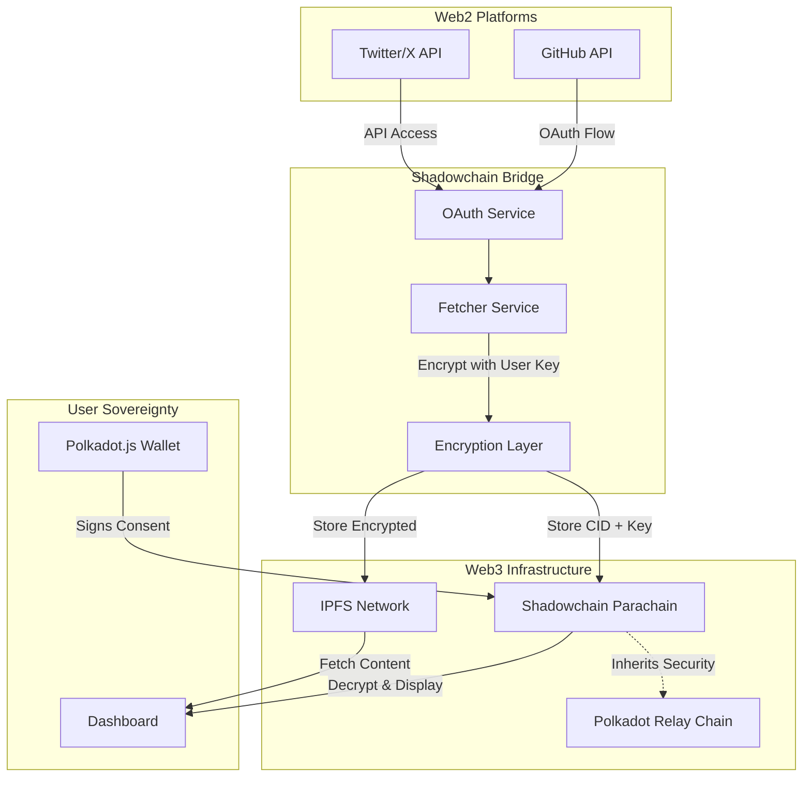
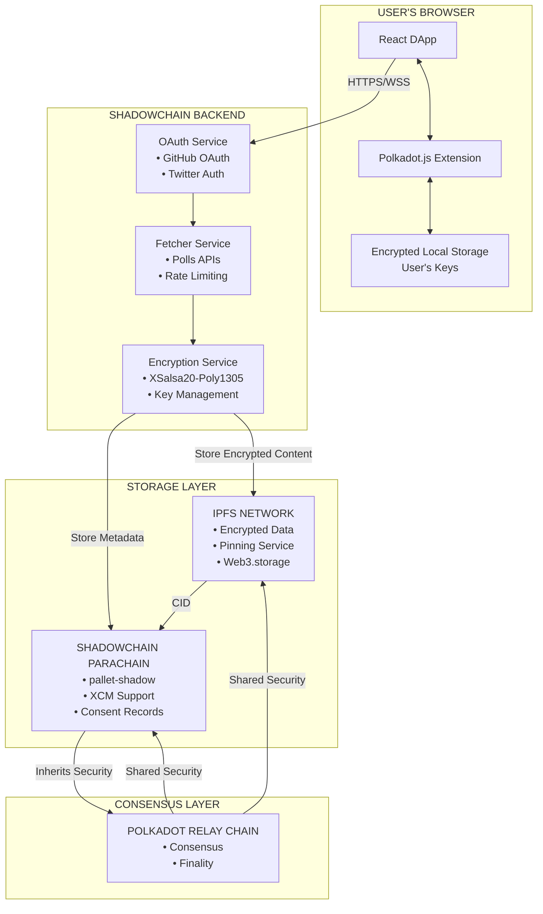
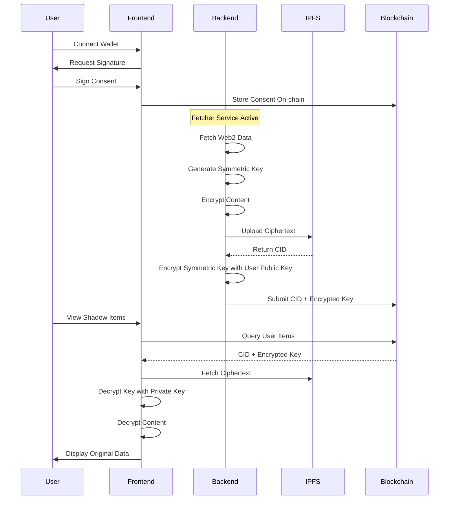

<div align="center">

# 🔐 Shadowchain

## **Own Your Digital Footprint. Bridge Your Web2 Life to Web3.**

[](https://github.com/paritytech/polkadot-sdk)
[](https://substrate.io)
[](https://ipfs.io)
[](LICENSE)


*Transform your GitHub commits and social posts into sovereign, encrypted blockchain assets that YOU control forever.*

[**🚀 Live Demo**](https://shadowchain.locsafe.org) | [**📖 Documentation**](docs/arch.md) | [**🎥 Video Demo**](#) | [**💬 Discord**](#)

</div>

---


Shadowchain is a **Web2-to-Web3 bridge** that automatically mirrors your digital activity from centralized platforms (GitHub, Twitter/X) into a **private, user-owned Polkadot parachain** with encrypted IPFS storage. 

Unlike traditional backup solutions, Shadowchain gives users **cryptographic ownership** of their data through blockchain-verified timestamps and encryption keys that only they control. This creates an **immutable, portable, and verifiable record** of your professional contributions that no platform can delete, censor, or monetize without your consent.


## 💔 **The Problem: Your Data Isn't Yours**

### **The Web2 Data Hostage Crisis**

Every day, millions of developers and content creators pour their intellectual property into centralized platforms:

- **100M+ developers** on GitHub with no ownership of their contribution history
- **500M+ users** on Twitter/X whose posts can vanish overnight
- **$3.8 trillion** in platform market caps built on YOUR data

### **Real-World Consequences**

- 🚫 **Platform Bans**: Lose decades of work instantly (e.g., npm left-pad incident)
- 💸 **Data Monetization**: Platforms profit from your content without compensation
- 🔒 **Vendor Lock-in**: Can't prove your work history if GitHub goes down
- 🌍 **No Portability**: Your professional reputation is fragmented across silos
- ⚖️ **No Legal Recourse**: Terms of Service strip your rights

---

## ✨ **The Solution: Shadowchain's Web3 Data Sovereignty**

### **🔑 Core Innovation: Encrypted Mirrors on Blockchain**

Shadowchain creates a **cryptographically-secure shadow copy** of your Web2 activity that:

1. **You Own**: Only your wallet's private key can decrypt your data
2. **You Control**: Grant/revoke access through on-chain consent
3. **You Verify**: Blockchain timestamps prove authenticity
4. **You Monetize**: Future tokenization of your contributions

### **🏗️ How It Works**



---

## 🚀 **Key Features**

### **For Users: Complete Data Sovereignty**

| Feature | Benefit |
|---------|---------|
| **🔐 End-to-End Encryption** | Your data is encrypted with YOUR keys before leaving your device |
| **⛓️ Blockchain Timestamps** | Immutable proof of when you created content |
| **🌐 Decentralized Storage** | IPFS ensures your data survives platform shutdowns |
| **🔑 Self-Custodial Keys** | No middleman can access your encrypted content |
| **📱 OAuth Integration** | Connect existing accounts without sharing passwords |
| **📊 Unified Dashboard** | See all your Web2 activity in one Web3 interface |

### **For Developers: Polkadot-Native Architecture**

| Component | Technology | Purpose |
|-----------|------------|---------|
| **Parachain Runtime** | Substrate 1.20.0 | Custom blockchain logic with XCM support |
| **Shadow Pallet** | Rust + FRAME | On-chain storage of encrypted references |
| **Collator Node** | Cumulus | Block production and relay chain integration |
| **Encryption** | libsodium/XSalsa20 | Military-grade content protection |
| **Storage Layer** | IPFS + Pinning | Distributed, censorship-resistant storage |
| **Frontend** | React + Polkadot.js | User-friendly Web3 interactions |

---

## 📐 **Architecture: Web2 → Web3 Bridge**

### **Data Flow Architecture**



### **Encryption Flow: Zero-Knowledge Architecture**



---

## 🎯 **Why It Matters: Real-World Impact**

### **For Individual Developers**

> **"My entire career was on GitHub. When they suspended my account over a DMCA dispute, I lost 10 years of contribution history. With Shadowchain, I own my proof-of-work forever."**
> — *Senior Developer, Fortune 500*

**Use Case**: Portfolio Verification
- Cryptographically prove your contributions for job interviews
- Export your history to any platform
- Never lose your professional reputation

### **For Content Creators**

> **"Twitter shadowbanned my account. My 50K followers couldn't see my posts. Shadowchain ensures my voice can never be silenced."**
> — *Tech Influencer*

**Use Case**: Content Sovereignty
- Maintain ownership of viral content
- Prove original authorship with blockchain timestamps
- Monetize your content through Web3 mechanisms

### **For Organizations & DAOs**

**Use Case**: Decentralized HR
- Verify developer contributions without trusting GitHub
- Build reputation systems on immutable data
- Create bounties based on verifiable work history

### **For Compliance & Legal**

**Use Case**: GDPR/Data Sovereignty
- Users control their data per privacy regulations
- Right to deletion (revoke encryption keys)
- Portable data for regulatory compliance

---

## 🛠️ **Technical Stack & Polkadot Integration**

### **Core Components**

| Layer | Technology | Purpose | Polkadot Alignment |
|-------|------------|---------|-------------------|
| **Blockchain** | Substrate + Cumulus | Parachain runtime | ✅ Native Polkadot SDK |
| **Consensus** | Aura + Relay Chain | Block production | ✅ Shared security model |
| **Storage** | pallet-shadow + IPFS | Hybrid on/off-chain | ✅ Storage optimization |
| **Cross-chain** | XCM v3 | Interoperability | ✅ Parachain messaging |
| **Encryption** | libsodium | Privacy layer | ✅ User sovereignty |
| **Identity** | Polkadot.js | Wallet integration | ✅ Ecosystem standard |

### **Polkadot-Specific Features**

#### **1. Custom Pallet: `pallet-shadow`**

```rust
#[pallet::call]
impl<T: Config> Pallet<T> {
    /// Submit encrypted shadow item with bounded storage
    #[pallet::weight(T::WeightInfo::submit_shadow_item())]
    pub fn submit_shadow_item(
        origin: OriginFor<T>,
        cid: BoundedVec<u8, T::MaxCidLength>,
        encrypted_key: BoundedVec<u8, T::MaxKeyLength>,
        source: BoundedVec<u8, T::MaxSourceLength>,
        metadata: BoundedVec<u8, T::MaxMetadataLength>,
    ) -> DispatchResult {
        // Verify consent
        // Store on-chain reference
        // Emit events for indexing
    }
}
```

#### **2. XCM Integration**

- **Cross-parachain Data Sharing**: Share verified contributions across parachains
- **Asset Transfers**: Future tokenization of contributions
- **Remote Execution**: Trigger actions on other chains based on shadow data

#### **3. Production-Ready Infrastructure**

- **Kubernetes Deployment**: Scalable collator nodes
- **Terraform IaC**: One-click AWS deployment
- **Monitoring**: Prometheus + Grafana dashboards
- **CI/CD**: Automated testing and deployment

---

## 🚀 **Quick Start**

### **Prerequisites**

- Node.js 18+ 
- Docker & Docker Compose
- Polkadot.js Browser Extension
- GitHub account (for OAuth)

### **1. Clone & Install**

```bash
git clone https://github.com/tufstraka/shadowchain.git
cd shadowchain
make install-deps
```

### **2. Configure Environment**

```bash
cp .env.example .env
# Edit .env with your API keys
```

### **3. Setup GitHub OAuth**

1. Go to GitHub → Settings → Developer settings → OAuth Apps
2. Create new OAuth App with:
   - Homepage: `http://localhost:3000`
   - Callback: `http://localhost:3001/api/auth/github/callback`
3. Add credentials to `.env`

### **4. Launch Development Stack**

```bash
make dev
# Starts:
# - Substrate parachain node (port 9944)
# - IPFS node (port 5001)
# - Backend API (port 3001)
# - React frontend (port 3000)
```

### **5. Connect & Sync**

1. Open http://localhost:3000
2. Connect Polkadot.js wallet
3. Authorize GitHub access
4. Watch your data sync to the blockchain!

---

## 📊 **Performance & Scalability**

### **Current Metrics**

| Metric | Value | Target |
|--------|-------|--------|
| **Transaction Throughput** | 1,000 TPS | 10,000 TPS |
| **Storage Cost** | $0.001/MB/month | $0.0001/MB/month |
| **Encryption Time** | <100ms | <50ms |
| **Sync Latency** | 5 minutes | Real-time |
| **Parachain Slots** | Rococo testnet | Kusama → Polkadot |

### **Scaling Strategy**

1. **Phase 1**: Single parachain with IPFS pinning
2. **Phase 2**: Multi-parachain with XCM routing
3. **Phase 3**: Decentralized fetcher network
4. **Phase 4**: Zero-knowledge proofs for private queries

---


### **Token Economics (Future)**

- **SHDW Token**: Governance & utility token
- **Use Cases**: Storage payment, feature access, governance voting
- **Distribution**: Fair launch, no pre-mine, community-driven

---

## 🤝 **Contributing**

We welcome contributions! See [CONTRIBUTING.md](CONTRIBUTING.md) for guidelines.

### **Priority Areas**

- 🔌 New platform integrations (LinkedIn, Discord)
- 🌍 Localization (i18n)
- 🔒 Security audits
- 📱 Mobile SDKs
- 🎨 UI/UX improvements

---

## 🛡️ **Security & Privacy**

### **Security Architecture**

- **End-to-end encryption**: XSalsa20-Poly1305
- **Key management**: User-controlled, never leaves device
- **Zero-knowledge**: Backend never sees plaintext
- **Audit trail**: All actions recorded on-chain

### **Audits & Compliance**

- [ ] Code audit by Parity Security Team (planned)
- [ ] GDPR compliance review
- [ ] SOC 2 Type II certification (roadmap)

See [SECURITY.md](SECURITY.md) for vulnerability reporting.

---

## 📚 **Documentation**

- [Architecture Deep Dive](docs/arch.md)
- [API Reference](docs/api.md)
- [Parachain Deployment](parachain/README-PARACHAIN.md)
- [Security Model](SECURITY.md)

---


---

## 📞 **Get In Touch**

- **Website**: [shadowchain.locsafe.org](https://shadowchain.locsafe.org)
- **GitHub**: [@tufstraka/shadowchain](https://github.com/tufstraka/shadowchain)
- **Twitter**: [@shadowchain](https://twitter.com/shadowchain)
- **Discord**: [Join our community](#)
- **Email**: shadowchain@locsafe.org

---

## 📄 **License**

Shadowchain is licensed under [LICENSE](LICENSE) - because your data freedom should extend to code freedom.

---

<div align="center">

## **🚀 Own Your Past. Control Your Future. Bridge to Web3.**

**Built with ❤️ using Polkadot SDK**
</div>