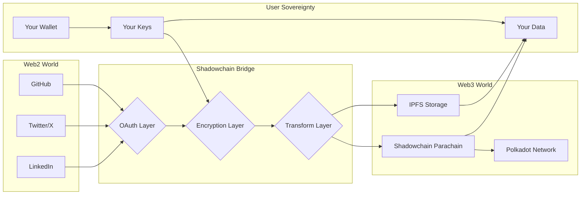
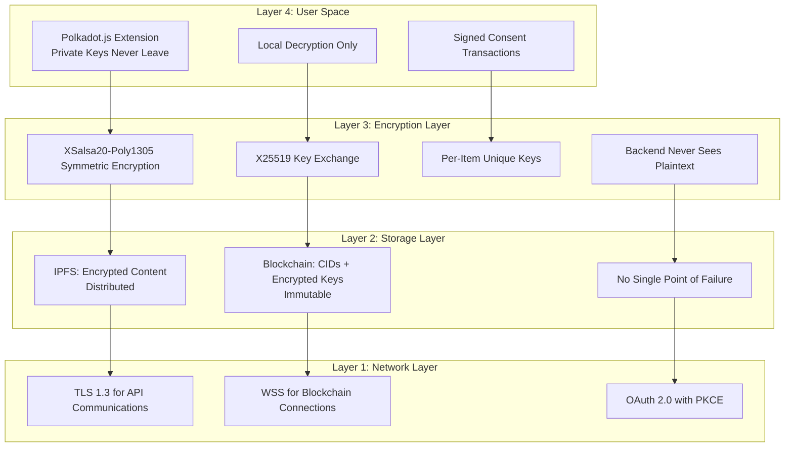
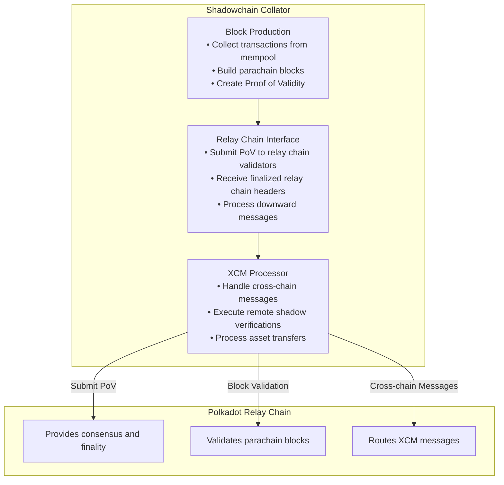
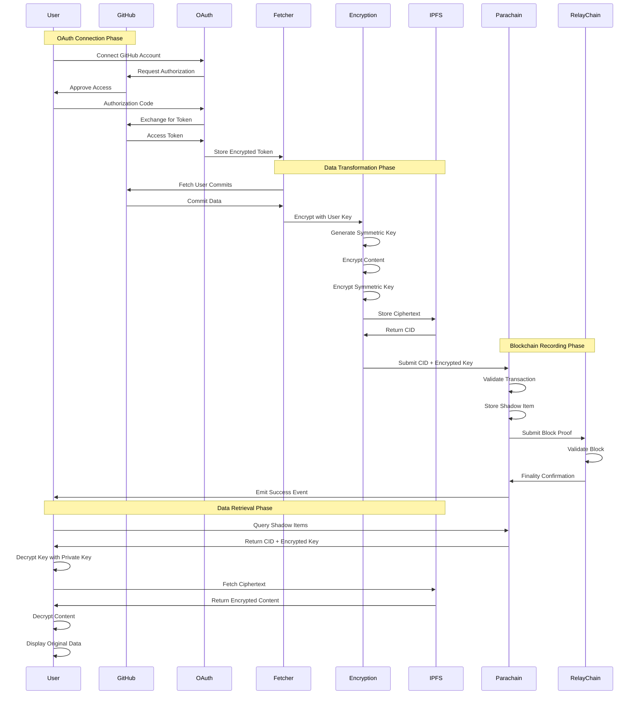
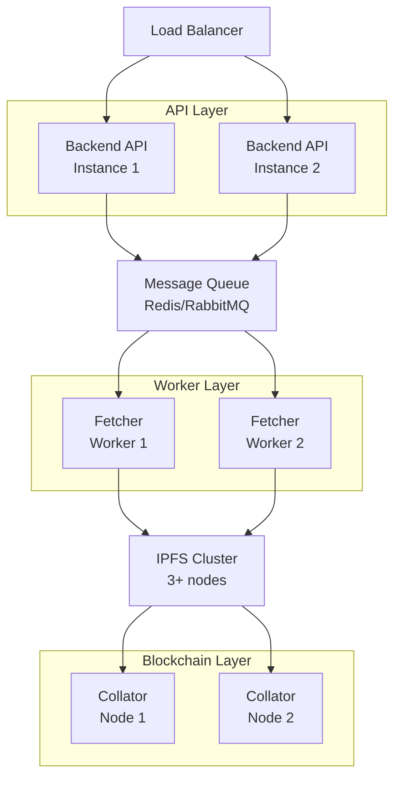
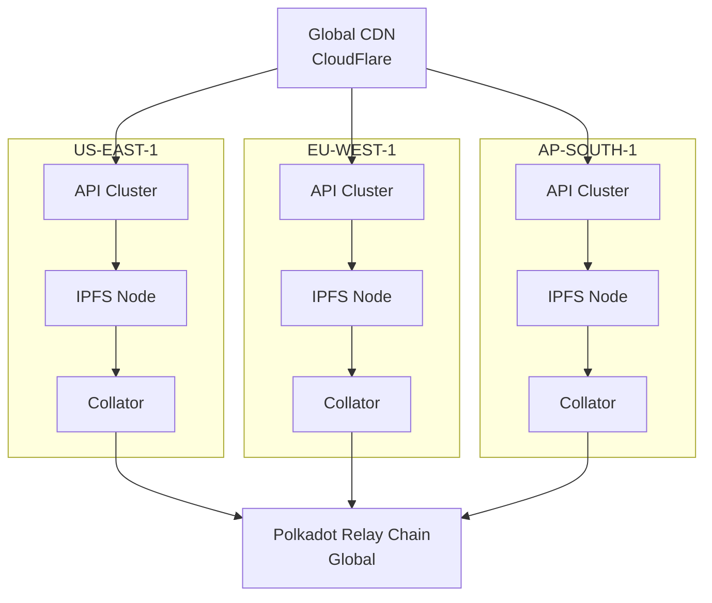
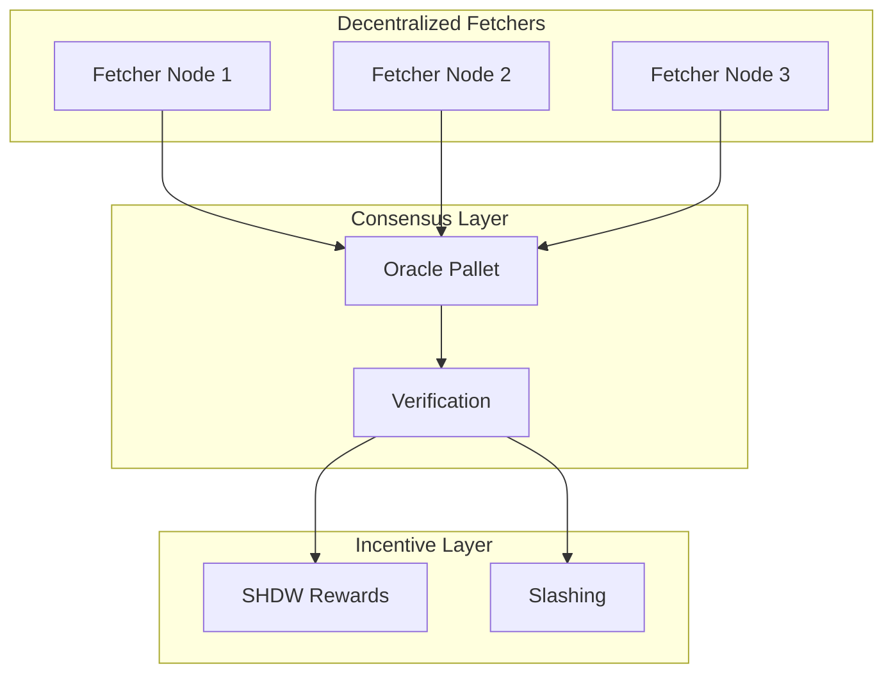

# 🏗️ Shadowchain Architecture

## **Technical Summary**

Shadowchain is a **cryptographic bridge** that transforms centralized Web2 data into decentralized, user-owned Web3 assets. Built on Polkadot SDK, it leverages parachain architecture for shared security while maintaining complete user sovereignty through end-to-end encryption.

**Core Innovation**: We don't just backup data—we **transform digital activity into blockchain-verified, encrypted assets** that users cryptographically own forever.

---

## 🌉 **The Bridge Architecture: Web2 → Web3**

### **Conceptual Overview**



### **Why This Architecture Matters**

| Traditional Web2 | Shadowchain Bridge | Result |
|-----------------|-------------------|--------|
| Platform owns data | User owns encryption keys | **True data ownership** |
| Centralized storage | IPFS + Blockchain | **Uncensorable persistence** |
| Platform-specific APIs | Unified Web3 interface | **Data portability** |
| No proof of creation | Blockchain timestamps | **Verifiable authenticity** |
| Account-based access | Wallet-based sovereignty | **Cryptographic control** |

---

## 🔐 **Security Architecture: Zero-Trust, Zero-Knowledge**

### **Multi-Layer Security Model**



### **Encryption Flow: Technical Deep Dive**

```typescript
// Step 1: Generate ephemeral symmetric key for content
const symmetricKey = crypto.randomBytes(32); // 256-bit key

// Step 2: Encrypt content with symmetric key
const encrypted = XSalsa20Poly1305.encrypt(
  plaintext: userContent,
  nonce: randomNonce,
  key: symmetricKey
);

// Step 3: Encrypt symmetric key with user's public key
const encryptedKey = crypto_box(
  message: symmetricKey,
  nonce: randomNonce,
  publicKey: userSubstratePublicKey,
  secretKey: ephemeralSecretKey
);

// Step 4: Store on IPFS and blockchain
const cid = await ipfs.add(encrypted.ciphertext);
await substrate.tx.shadow.submitShadowItem(
  cid,
  encryptedKey,
  metadata
);

// Step 5: User decrypts with their private key
const symmetricKey = crypto_box_open(
  ciphertext: encryptedKey,
  nonce: item.nonce,
  publicKey: ephemeralPublicKey,
  secretKey: userPrivateKey // Never leaves user's device
);

const plaintext = XSalsa20Poly1305.decrypt(
  ciphertext: ipfsContent,
  nonce: item.nonce,
  key: symmetricKey
);
```

---

## ⛓️ **Parachain Architecture: Polkadot-Native Design**

### **Substrate Runtime Architecture**

```rust
// Custom pallet leveraging Polkadot SDK
#[pallet]
pub mod pallet_shadow {
    use frame_support::{
        dispatch::DispatchResult,
        pallet_prelude::*,
        traits::{Currency, Randomness, Time},
    };
    use frame_system::pallet_prelude::*;
    use sp_runtime::traits::Saturating;
    
    #[pallet::config]
    pub trait Config: frame_system::Config {
        type RuntimeEvent: From<Event<Self>>;
        type Currency: Currency<Self::AccountId>;
        type MaxItemsPerAccount: Get<u32>;
        type MaxCidLength: Get<u32>;
        type MaxKeyLength: Get<u32>;
        type WeightInfo: WeightInfo;
    }
    
    #[pallet::storage]
    #[pallet::getter(fn shadow_items)]
    pub type ShadowItems<T: Config> = StorageDoubleMap<
        _,
        Blake2_128Concat,
        T::AccountId,
        Blake2_128Concat,
        T::Hash,
        ShadowItem<T>,
        OptionQuery,
    >;
    
    #[pallet::event]
    #[pallet::generate_deposit(pub(super) fn deposit_event)]
    pub enum Event<T: Config> {
        /// Shadow item submitted [owner, item_id, cid]
        ShadowItemSubmitted(T::AccountId, T::Hash, Vec<u8>),
        /// Consent granted [account, expires_at]
        ConsentGranted(T::AccountId, T::BlockNumber),
        /// Item deleted [owner, item_id]
        ItemDeleted(T::AccountId, T::Hash),
    }
}
```

### **Cross-Chain Messaging (XCM) Integration**

```rust
// XCM configuration for cross-parachain data sharing
impl xcm_executor::Config for XcmConfig {
    type RuntimeCall = RuntimeCall;
    type XcmSender = XcmRouter;
    type AssetTransactor = LocalAssetTransactor;
    type OriginConverter = XcmOriginToTransactDispatchOrigin;
    
    // Enable shadow data verification across parachains
    type CallDispatcher = WithShadowVerification<RuntimeCall>;
    type IsReserve = NativeAsset;
    type IsTeleporter = ();
}

// Example: Cross-chain shadow data verification
pub fn verify_shadow_item_cross_chain(
    para_id: ParaId,
    account: AccountId,
    item_hash: Hash,
) -> Xcm<()> {
    Xcm(vec![
        UnpaidExecution { weight_limit: Unlimited },
        Transact {
            origin_type: OriginKind::Native,
            require_weight_at_most: Weight::from_parts(1_000_000_000, 64 * 1024),
            call: shadow_pallet::verify_item(account, item_hash).encode().into(),
        },
        RefundSurplus,
        DepositAsset {
            assets: All.into(),
            beneficiary: Parachain(para_id).into(),
        },
    ])
}
```

### **Parachain Collator Architecture**



---

## 🔄 **Data Flow: From Web2 API to Web3 Ownership**

### **Complete Data Journey**



### **OAuth Integration Architecture**

```typescript
// OAuth service with secure token management
class OAuthService {
    // Step 1: Initiate OAuth flow
    async connectGitHub(walletAddress: string): Promise<string> {
        const state = crypto.randomBytes(32).toString('hex');
        await redis.setex(`oauth:state:${state}`, 600, walletAddress);
        
        return `https://github.com/login/oauth/authorize?${qs.stringify({
            client_id: process.env.GITHUB_CLIENT_ID,
            redirect_uri: process.env.GITHUB_CALLBACK_URL,
            scope: 'read:user repo',
            state,
        })}`;
    }
    
    // Step 2: Handle callback and store encrypted token
    async handleCallback(code: string, state: string) {
        const walletAddress = await redis.get(`oauth:state:${state}`);
        if (!walletAddress) throw new Error('Invalid state');
        
        const { access_token } = await exchangeCodeForToken(code);
        
        // Encrypt token before storage
        const encrypted = await encryptForStorage(access_token, walletAddress);
        await TokenStore.save(walletAddress, 'github', encrypted);
        
        // Trigger initial sync
        await FetcherService.syncUserData(walletAddress);
    }
    
    // Step 3: Use token for API calls
    async fetchWithToken(walletAddress: string, service: string) {
        const encrypted = await TokenStore.get(walletAddress, service);
        const token = await decryptToken(encrypted, walletAddress);
        
        return await apiClient.get({
            headers: { Authorization: `Bearer ${token}` }
        });
    }
}
```

---

## 📊 **Performance & Scalability Architecture**

### **Horizontal Scaling Strategy**



### **Performance Metrics & Optimization**

| Component | Current | Optimized | Method |
|-----------|---------|-----------|---------|
| **API Response** | 200ms | <50ms | Redis caching, CDN |
| **Encryption** | 100ms | <20ms | WebAssembly, parallel processing |
| **IPFS Upload** | 2s | <500ms | Pinning service, pre-warming |
| **Block Time** | 12s | 6s | Optimistic confirmation |
| **Query Speed** | 500ms | <100ms | Substrate indexer |

### **Caching Architecture**

```typescript
// Multi-layer caching strategy
class CacheStrategy {
    // L1: Memory cache (fastest)
    private memCache = new LRUCache({ max: 1000 });
    
    // L2: Redis cache (distributed)
    private redis = new Redis.Cluster(redisNodes);
    
    // L3: IPFS cache (persistent)
    private ipfsCache = new IPFSCache(ipfsCluster);
    
    async get(key: string): Promise<any> {
        // Try L1
        let data = this.memCache.get(key);
        if (data) return data;
        
        // Try L2
        data = await this.redis.get(key);
        if (data) {
            this.memCache.set(key, data);
            return data;
        }
        
        // Try L3
        data = await this.ipfsCache.get(key);
        if (data) {
            await this.redis.setex(key, 3600, data);
            this.memCache.set(key, data);
            return data;
        }
        
        return null;
    }
}
```

---

## 🔍 **Monitoring & Observability**

### **Full-Stack Observability**

```yaml
# Prometheus metrics configuration
metrics:
  - name: shadow_items_created_total
    type: counter
    help: Total number of shadow items created
    
  - name: encryption_duration_seconds
    type: histogram
    help: Time taken to encrypt content
    
  - name: ipfs_upload_duration_seconds
    type: histogram
    help: Time taken to upload to IPFS
    
  - name: substrate_extrinsic_success_rate
    type: gauge
    help: Success rate of substrate extrinsics
    
  - name: oauth_connections_active
    type: gauge
    help: Number of active OAuth connections

# Grafana dashboards
dashboards:
  - user_activity:
      panels:
        - shadow_items_per_user
        - encryption_performance
        - storage_usage
        
  - system_health:
      panels:
        - api_response_times
        - error_rates  
        - parachain_block_production
        
  - security:
      panels:
        - failed_auth_attempts
        - encryption_key_usage
        - consent_revocations
```

### **Distributed Tracing**

```typescript
// OpenTelemetry integration
import { trace } from '@opentelemetry/api';

const tracer = trace.getTracer('shadowchain');

async function processShadowItem(data: any) {
    const span = tracer.startSpan('process_shadow_item');
    
    try {
        span.addEvent('fetch_started');
        const content = await fetchContent(data);
        
        span.addEvent('encryption_started');
        const encrypted = await encrypt(content);
        
        span.addEvent('ipfs_upload_started');
        const cid = await ipfs.add(encrypted);
        
        span.addEvent('blockchain_submission_started');
        await substrate.submit(cid);
        
        span.setStatus({ code: SpanStatusCode.OK });
    } catch (error) {
        span.recordException(error);
        span.setStatus({ code: SpanStatusCode.ERROR });
        throw error;
    } finally {
        span.end();
    }
}
```

---

## 🚀 **Deployment Architecture**

### **Production Kubernetes Architecture**

```yaml
apiVersion: apps/v1
kind: Deployment
metadata:
  name: shadowchain-backend
spec:
  replicas: 3
  selector:
    matchLabels:
      app: shadowchain-backend
  template:
    metadata:
      labels:
        app: shadowchain-backend
    spec:
      containers:
      - name: api
        image: shadowchain/backend:latest
        ports:
        - containerPort: 3001
        env:
        - name: NODE_ENV
          value: production
        - name: SUBSTRATE_WS
          value: wss://parachain.shadowchain.io
        resources:
          requests:
            memory: "512Mi"
            cpu: "500m"
          limits:
            memory: "1Gi"
            cpu: "1000m"
        livenessProbe:
          httpGet:
            path: /health
            port: 3001
          initialDelaySeconds: 30
          periodSeconds: 10
---
apiVersion: v1
kind: Service
metadata:
  name: shadowchain-backend
spec:
  selector:
    app: shadowchain-backend
  ports:
  - port: 80
    targetPort: 3001
  type: LoadBalancer
```

### **Multi-Region Deployment**



---

## 🔮 **Future Architecture Enhancements**

### **Phase 2: Decentralized Fetcher Network**



### **Phase 3: Zero-Knowledge Privacy Layer**

```rust
// ZK-SNARK integration for private queries
pub fn verify_shadow_ownership_zk(
    proof: ZkProof,
    public_inputs: Vec<Field>,
) -> Result<bool, Error> {
    // Verify ownership without revealing content
    let vk = VerifyingKey::from_bytes(&ZK_VERIFYING_KEY)?;
    let proof = Proof::from_bytes(&proof.0)?;
    
    verify_proof(&vk, &proof, &public_inputs)
        .map_err(|_| Error::InvalidProof)
}
```

### **Phase 4: AI-Powered Insights**

```typescript
// AI analysis of shadow data patterns
class ShadowInsights {
    async analyzeContributions(address: string) {
        const items = await this.getShadowItems(address);
        
        return {
            contributionScore: await this.calculateScore(items),
            techStack: await this.detectTechnologies(items),
            activityPattern: await this.analyzePattern(items),
            recommendations: await this.generateRecommendations(items),
        };
    }
}
```

---

## 📚 **Technical Standards & Compliance**

### **Standards Compliance**

| Standard | Implementation | Status |
|----------|---------------|---------|
| **OAuth 2.0** | PKCE flow for secure authorization | ✅ Implemented |
| **WebAuthn** | Hardware key support | 🚧 Planned |
| **W3C DID** | Decentralized identifiers | 🚧 Integration planned |
| **IPLD** | Linked data structures | ✅ Supported |
| **EIP-712** | Typed data signing | ✅ Compatible |

### **Security Audits**

- [ ] Smart Contract Audit (Q1 2025)
- [ ] Penetration Testing (Q1 2025)  
- [ ] Cryptography Review (Q2 2025)
- [ ] GDPR Compliance Audit (Q2 2025)

---

## 🛠️ **Developer Integration Guide**

### **SDK Usage Example**

```typescript
import { ShadowchainSDK } from '@shadowchain/sdk';

// Initialize SDK
const shadow = new ShadowchainSDK({
    nodeUrl: 'wss://parachain.shadowchain.io',
    ipfsGateway: 'https://ipfs.shadowchain.io',
});

// Connect wallet
await shadow.connect();

// Grant consent for GitHub sync
await shadow.grantConsent({
    platform: 'github',
    duration: 30 * 24 * 60 * 60, // 30 days
});

// Query shadow items
const items = await shadow.getItems();

// Decrypt specific item
const decrypted = await shadow.decrypt(items[0]);
console.log(decrypted.content);

// Verify item across chains
const proof = await shadow.createCrossChainProof(items[0]);
await shadow.verifyCrossChain(proof, 'moonbeam');
```

---

## 🌐 **Ecosystem Integration Points**

### **Polkadot Ecosystem Synergies**

| Project | Integration | Benefit |
|---------|------------|---------|
| **Moonbeam** | Smart contract calls | DeFi integration for data monetization |
| **Acala** | DeFi primitives | Stake SHDW tokens for yield |
| **KILT** | DID integration | Verifiable credentials from shadow data |
| **Phala** | Confidential computing | Private computation on encrypted data |
| **Crust** | Decentralized storage | Alternative to IPFS |
| **Subsocial** | Social features | Share verified contributions |

---


<div align="center">

## **Built for the Future of Data Sovereignty**

**Shadowchain: Where Web2 Meets Web3**

*Powered by Polkadot SDK*

</div>